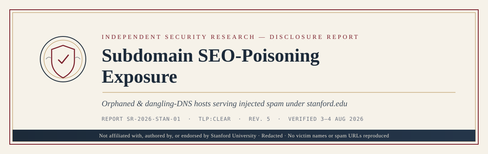
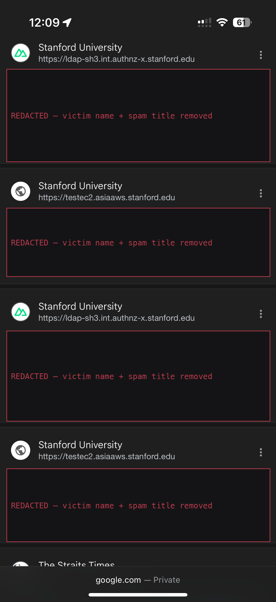
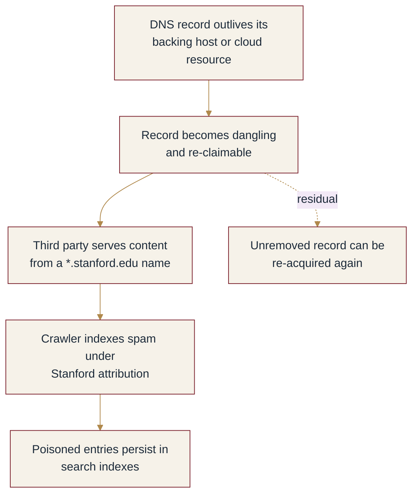
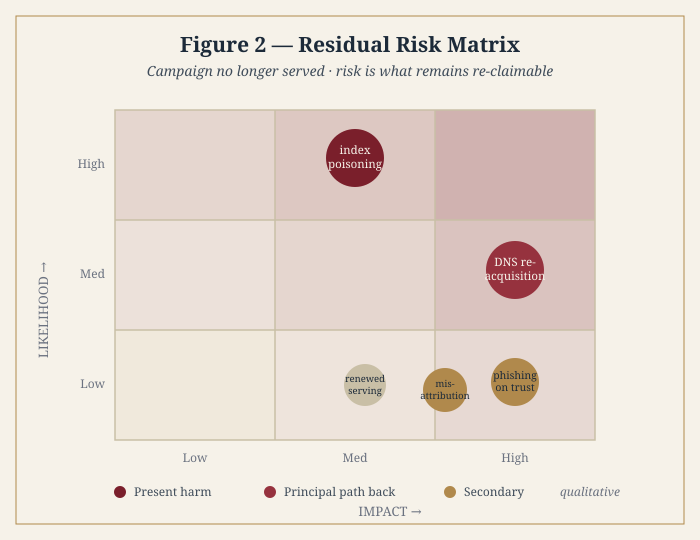

<div align="center">

### An Independent Security-Research Disclosure Whitepaper

**Not affiliated with, authored by, or endorsed by Stanford University.**
Redacted: no victim names or spam URLs are reproduced.

</div>

---

### Document control

| Field | Value |
|-------|-------|
| Report reference | SR-2026-STAN-01 |
| Title | Subdomain SEO-Poisoning Exposure under `stanford.edu` |
| Version / Status | **Rev. 5** — independently verified, evidence-tiered |
| Classification | TLP:CLEAR (public; PII and payloads redacted) |
| Observed campaign window | December 2024 → February 2026 (archive captures) |
| Verification | CT logs + Internet Archive, 3 Aug 2026 · DNS re-checked 4 Aug 2026 |
| Evidence basis | Public search indexes, Certificate Transparency, Internet Archive, public DNS. No authentication, exploitation, or access to non-public data. |
| Reproduce | [`tools/sweep.sh`](tools/sweep.sh) · [`docs/evidence/`](docs/evidence/) |

---

## Abstract

Subdomains under `stanford.edu` — most named for **test, development, demonstration,
internal, or cloud** infrastructure — were used to serve SEO-spam promoting adult "leaked
video" content, indexed by search engines under the Stanford University brand. Archived
captures place the campaign between **December 2024 and February 2026**.

**The campaign is no longer being served.** Tested spam paths return 404 and the
AWS-resolving hosts have no listener. What remains is **dangling DNS**: records that outlived
their backing resources and stay re-claimable. Search indexes still carry poisoned entries,
so brand impact persists until de-indexing completes.

This revision is **evidence-tiered**. Five hosts are confirmed by archived captures of the
spam itself; others rest on weaker evidence and are labelled accordingly. Three hosts
previously listed have been **excluded as false positives**.

> Findings are only as good as the evidence shown, so every tier below links to a command you
> can run. Claims withdrawn since earlier revisions are listed in
> [`docs/CHANGELOG.md`](docs/CHANGELOG.md).

## Contents

1. [Method & evidence tiers](#1-method--evidence-tiers) · 2. [Findings](#2-findings) ·
3. [Excluded](#3-excluded--false-positives) · 4. [Evidence](#4-evidence) ·
5. [Analysis](#5-analysis) · 6. [Risk & remediation](#6-risk--remediation) ·
7. [Retractions](#7-retractions) · 8. [Disclosure](#8-responsible-disclosure)

---

## 1. Method & evidence tiers

Hosts were enumerated with `site:stanford.edu` keyword queries, then tested against
independent sources: **Certificate Transparency** (did the name ever hold a certificate?) and
the **Internet Archive** (what did it actually serve?), plus public DNS.

```bash
# existence — did the hostname ever hold a certificate?
curl -s "https://crt.sh/?q=<host>&output=json" | python3 -c "import sys,json;print(len(json.load(sys.stdin)))"

# what did it actually serve?
curl -s "https://web.archive.org/cdx/search/cdx?url=<host>/*&matchType=domain&output=json&limit=8&collapse=urlkey"
```

| Tier | Meaning |
|------|---------|
| **A** | Archived capture of a spam URL returning HTTP 200 — the spam itself is on record |
| **B** | Archived reachability + independent index evidence; no archived spam path |
| **C** | Reachable, spam attribution from search index only |
| **D** | Insufficient evidence — not a finding |

**Withheld by design.** Spam URLs, slugs, page titles, and the individuals' names they
contain. Those attach real people to fabricated sexual content; republishing them would
extend the harm and boost the spam in search. Victim-name segments in evidence files are
masked as `<name>`, leaving timestamps, status codes, and path structure intact so results
remain reproducible.

## 2. Findings

**Table 1 — Confirmed and candidate hosts**

| Tier | Host | Apparent role | Evidence | DNS (4 Aug 2026) |
|------|------|---------------|----------|------------------|
| **A** | `forum-daemo.stanford.edu` | Forum demo | Spam paths 200, Dec 2024; fabricated `ask*` sections | NXDOMAIN |
| **A** | `eedpoccmg01.stanford.edu` | Opaque / POC | Spam `/video/` tree 200 while app assets 404, Jan 2025 | NXDOMAIN |
| **A** | `snipe-it.stanford.edu` | Snipe-IT asset mgmt | Spam 200, Jun 2025; WordPress *Jannah* theme on a Snipe-IT host | NXDOMAIN |
| **A** | `smc-aws-pub.stanford.edu` | AWS public host | Spam 200, **Feb 2026 — most recent capture** | A `54.153.7.154` (no listener) |
| **B** | `ldap-sh3.int.authnz-x.stanford.edu` | Internal auth / LDAP | Root 200 Jun 2025; in Exhibit A | NXDOMAIN |
| **B** | `testec2.asiaaws.stanford.edu` | AWS EC2 test | Root 200 May 2025; in Exhibit A | NXDOMAIN |
| **C** | `edtechdev1.stanford.edu` | EdTech dev | Root 200 + catch-all 302 signature | NXDOMAIN |
| **C** | `swarm01.ic.stanford.edu` | Instructional computing | Root 200 + catch-all 302 signature | NXDOMAIN |
| **C** | `webapp-new.itlab.stanford.edu` | IT Lab web app | Root 200 + catch-all 302 signature | `CNAME → .` (malformed) |
| **C** | `sbc-hc-proxy.stanford.edu` | Proxy host | Root 200, same catch-all pattern | A `54.185.146.111` (no listener) |
| **D** | `glucose-dev.stanford.edu` | Dev host | Single 2023 capture, no status — **not a finding** | NXDOMAIN |

### 2.1 The Tier-C signature

The Tier-C hosts share a distinctive pattern: root returns **200**, and **every**
`/.well-known/*` probe returns **302**. A normal application 404s unknown well-known paths; a
blanket redirect handler is characteristic of a doorway/spam stack. It is suggestive, not
conclusive — hence Tier C.

### 2.2 Residual risk: dangling DNS

Two hosts (`smc-aws-pub`, `sbc-hc-proxy`) still resolve to **AWS elastic IPs** with **no
service listening**, and `webapp-new.itlab` carries a malformed `CNAME → .`. Nothing is being
served today. The risk is that an unremoved record pointing at releasable cloud space can be
**re-acquired** — the same precondition that enabled the original takeover.

## 3. Excluded — false positives

Listing a legitimate site as compromised causes real institutional harm. Three hosts named in
earlier revisions are excluded:

| Host | Why excluded |
|------|--------------|
| `cs355.stanford.edu` | **Retracted.** Legitimate course site running continuously 1999→2026; its GitHub Pages CNAME and certificate are ordinary custom-domain hosting. |
| `platformlab.stanford.edu` | **Probable false positive.** Real research-group site, captures from 2016; `/.well-known/*` returns **404** — the inverse of the Tier-C spam signature. |
| `widescope.stanford.edu` | **Probable false positive.** Legitimate project site with `about.html` and `aboutus_files/`, captured 2011–2016. No spam capture. |

Claims against **live, operating** infrastructure (e.g. a Stanford Medicine blog, a SLAC/SSRL
site) that appeared in an interim revision were **not corroborated** by this verification pass
and are **withheld**, not published as findings.

## 4. Evidence

### Exhibit A — search results (redacted)



*Figure 1.* Results served under **Stanford University** attribution. Only the title and
description bands — which named individuals and described the spam — are redacted; hostnames
and the search engine's attribution are preserved.

### Exhibit B — raw verification output

Per-tier query output, with victim-name segments masked:
[`docs/evidence/verification-2026-08-03.md`](docs/evidence/verification-2026-08-03.md).
Raw sweep log: [`docs/evidence/sweep-2026-08-02.txt`](docs/evidence/sweep-2026-08-02.txt).

Two details worth noting, because they are the kind of thing a fabricated finding would not
produce:

- **`eedpoccmg01`** — the original application's `/Content/*.css` assets were already
  returning 404 while the injected `/video/` tree returned 200. The spam outlived the app.
- **`snipe-it`** — assets load from `/assets/css/jannah/`. *Jannah* is a commercial WordPress
  magazine theme; the host is named for an asset-management application. The substitution is
  the evidence.

## 5. Analysis



**Mechanism — hypothesis.** Dangling DNS enabling subdomain takeover remains the best fit:
the confirmed hosts are non-production names, and the surviving records point at releasable
AWS space. Confirming it requires Stanford's internal DNS and cloud-account records, which
are not publicly observable. Alternatives — an abandoned host compromised in place, or an
injectable upload path — are not excluded.

**Weaknesses:** CWE-350 (stale DNS reliance), CWE-1327 (binding to an abandoned resource),
CWE-16 (configuration weakness), CWE-284 (internal host publicly reachable).

## 6. Risk & remediation



*Figure 2.* Qualitative likelihood × impact for the **residual** exposure. Index poisoning is
the certain, present harm; DNS re-acquisition is the principal path back to active abuse.

| Priority | Action |
|----------|--------|
| **Immediate** | Remove the surviving records (`smc-aws-pub`, `sbc-hc-proxy`, `webapp-new.itlab`) and release or reclaim the backing AWS resources so the names cannot be re-served. |
| **Immediate** | Complete de-indexing of poisoned URLs via Search Console / Bing Webmaster Tools — brand impact persists while entries remain. |
| **Short term** | Inventory non-production and internal subdomains; confirm which should be publicly resolvable at all. |
| **Structural** | Decommission DNS records *before* tearing down backing resources; scan periodically for dangling records; maintain a subdomain registry with owner, purpose, and expiry. |

## 7. Retractions

Earlier revisions of this report named hosts that further verification cleared. These stay on
the page because the original claims were public — the sites are named in §3 above as
**not affected**.

Method and revision history: [`docs/CHANGELOG.md`](docs/CHANGELOG.md).

## 8. Responsible disclosure

Recommended recipient: **Stanford University Information Security** —
`security@stanford.edu`. Material here is redacted of payloads and PII; surviving records are
flagged for action rather than described in exploitable detail. Unverified allegations against
live infrastructure are withheld rather than published.

Full report: [`docs/full-report.md`](docs/full-report.md).

---

<div align="center">
<sub>Independent security research · TLP:CLEAR · Redacted · Not a Stanford University publication</sub>
</div>
